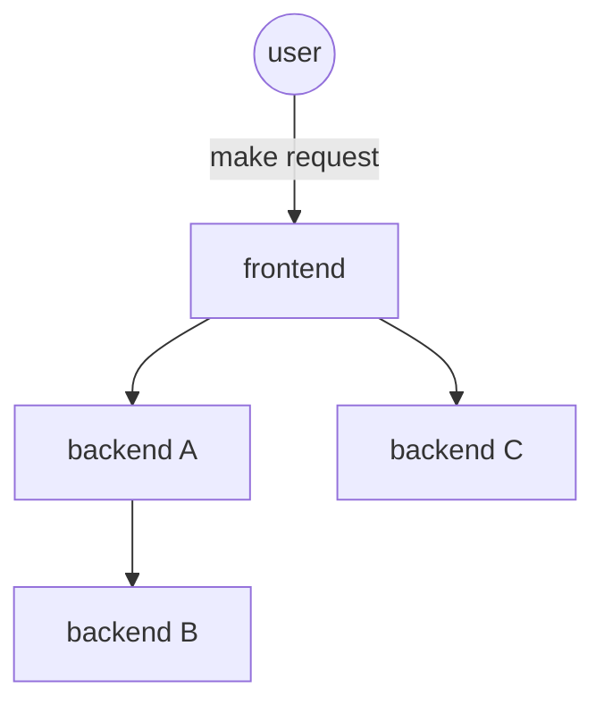

# ResilienceBench-Operator

ResilienceBench-Operator ia a Kubernetes-native tool designed to automate resilience experiments in microservice applications. It enables engineers and researchers to define and execute fault injection scenarios directly on services running in Kubernetes clusters.

The tool builds on the original [ResilienceBench]((https://github.com/ppgia-unifor/resilience-bench)), expanding its capabilities to real-world deployments through a declarative, CRD-based approach. It simplifies the orchestration of experiments that test patterns like Retry and Circuit Breaker under realistic conditions.

### Architecture


### Usage scenario

Consider a microservices-based application like the diagram bellow, where the connectors represent communication between the services. Each service is subject to several failure possibilities and workload variations, and for each of these situations, there is an appropriate configuration of resilience patterns. In this context, the tool's purpose is to automate the creation of test scenarios, exhaustively evaluating all possible scenarios under different load levels and failure conditions with minimal configuration.



## Prerequisites

Before you begin development, ensure you have the following prerequisites installed and configured on your system:

- **Java JDK 17**: Required for developing Java applications. Ensure JAVA_HOME is set to the JDK's installation directory.
- **Maven**: Used for project build and dependency management. Verify its installation by running `mvn -v` in your terminal.
- **Docker**: Necessary for building and pushing container images.
- **kubectl**: The Kubernetes command-line tool, used to interact with your Kubernetes cluster.
- **A Kubernetes Cluster**: You need an accessible Kubernetes cluster where the operator will be deployed.


### Project setup for coding

1. Clone the repository to build and :

   ```bash
   git clone https://github.com/ppgia-unifor/resilience-bench-operator.git
   cd resilience-bench-operator/resilience-bench
   mvn clean install
   ```

2. Open it in your preferred code editor and have fun!

### Project setup for running

1. Clone the repository to your local machine

```bash
git clone https://github.com/ppgia-unifor/resilience-bench-operator.git
```

2. Install the CRD, the operator and one of the samples:

To install the CRD:

```bash
kubectl apply -f ./crd
```

To install the hipstershop samples:

```bash
kubectl apply -k ./samples/overlays/hipstershop
```

## License

This project is licensed under the MIT License - see the [LICENSE](license.md) file for details.
