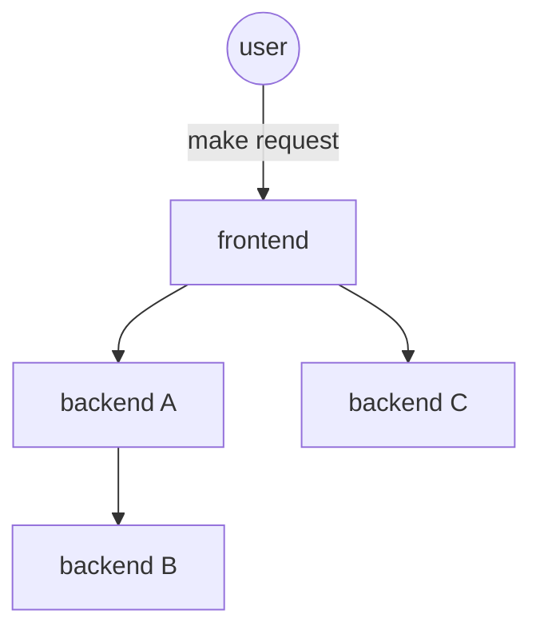

# ResilienceBench-Operator


ResilienceBench is a language-agnostic benchmark environment to support the experimental evaluation of microservice resiliency patterns, such as Retry and Circuit Breaker. This operator represents an evolution of the original version, also named [resilience bench](https://github.com/ppgia-unifor/resilience-bench). The new version retains the core objectives of the original, but is specifically tailored for microservice-based applications.

### Architecture


### Usage scenario

Consider a microservices-based application like the diagram bellow, where the connectors represent communication between the services. Each service is subject to several failure possibilities and workload variations, and for each of these situations, there is an appropriate configuration of resilience patterns. In this context, the tool's purpose is to automate the creation of test scenarios, exhaustively evaluating all possible scenarios under different load levels and failure conditions with minimal configuration.



## Prerequisites

Before you begin development, ensure you have the following prerequisites installed and configured on your system:

- **Java JDK 17**: Required for developing Java applications. Ensure JAVA_HOME is set to the JDK's installation directory.
- **Maven**: Used for project build and dependency management. Verify its installation by running `mvn -v` in your terminal.
- **Docker**: Necessary for building and pushing container images.
- **kubectl**: The Kubernetes command-line tool, used to interact with your Kubernetes cluster.
- **A Kubernetes Cluster**: You need an accessible Kubernetes cluster where the operator will be deployed.

## Istio dependency

Istio installation is optional; it is required only if you plan to use the Istio sections in the Benchmark custom resource. 

[Istio Installation Documentation](https://istio.io/latest/docs/setup/install/)

### Project Setup

1. Clone the repository to your local machine and install it:

   ```bash
   git clone https://github.com/cmendesce/resilience-bench-operator.git
   cd resilience-bench-operator/resilience-bench
   mvn clean install
   ```

## License

This project is licensed under the MIT License - see the [LICENSE](license.md) file for details.
